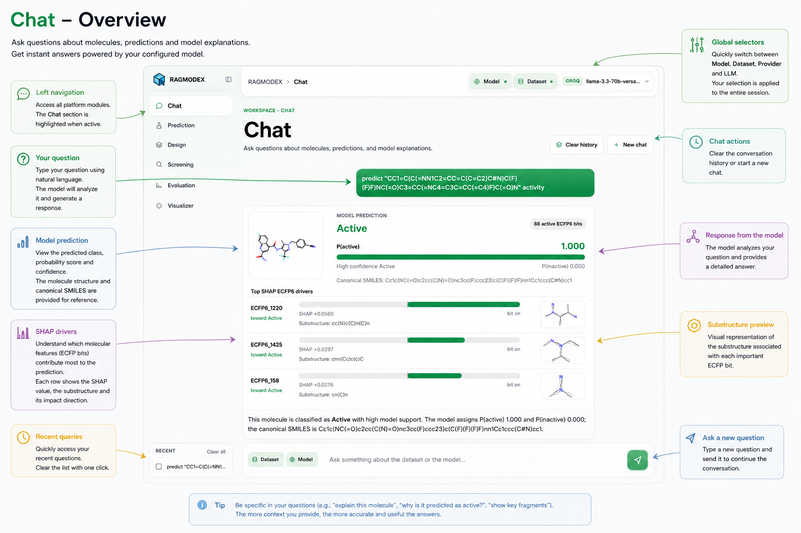
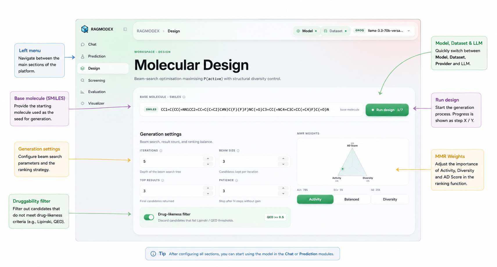
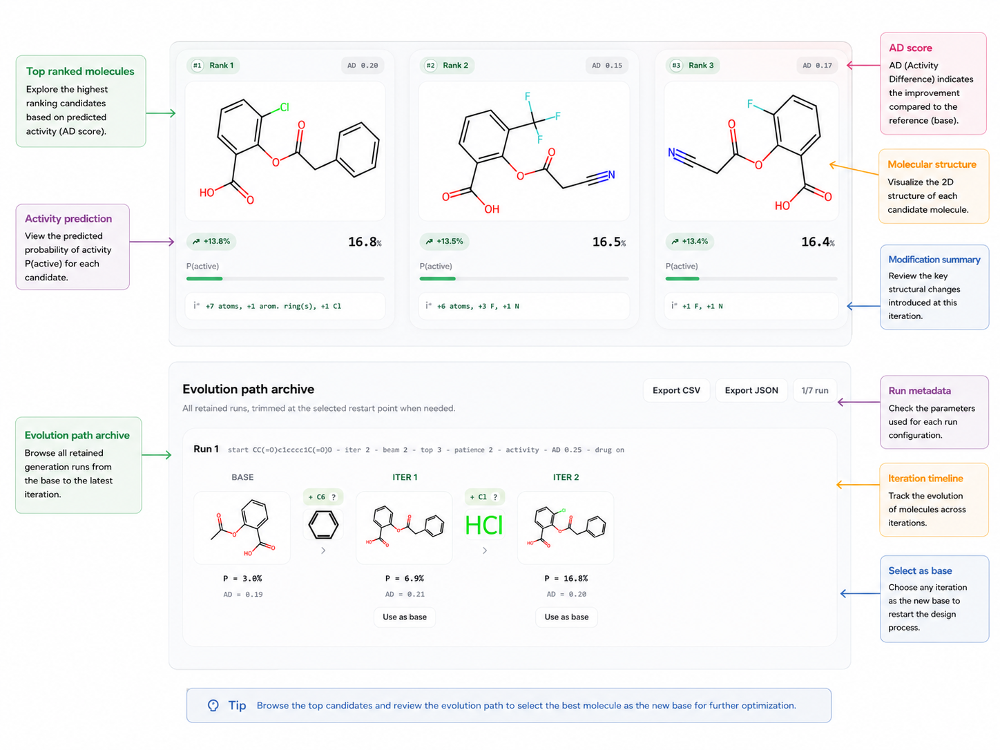
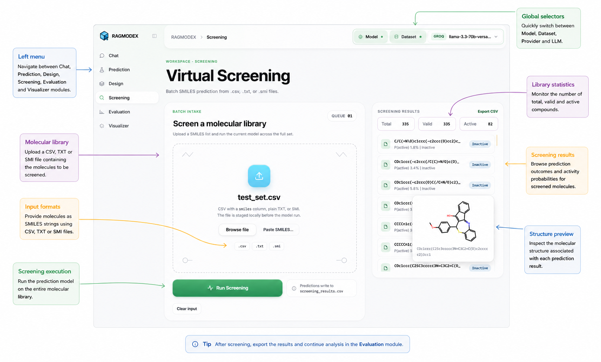
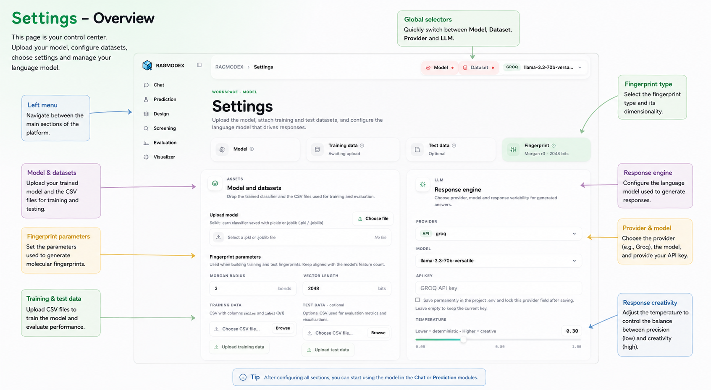

# RAGMODEX

RAGMODEX, short for **Retrieval-Augmented Generation for Molecular Design and Explainable AI**, is a molecular machine-learning workbench for predicting, explaining, and optimizing bioactivity from SMILES strings. It combines a React/Vite interface with a FastAPI backend that runs RDKit fingerprints, scikit-learn model inference, SHAP explanations, virtual screening, molecule design, and optional RAG-assisted chat.

The project is structured as a portfolio-ready full-stack application: the frontend owns the product experience, while the backend exposes a focused API for molecular ML workflows.

## Portfolio Highlights

- Full-stack scientific web application built with React, TypeScript, FastAPI, and Python.
- Applied machine-learning workflow for molecular bioactivity prediction using RDKit fingerprints, scikit-learn inference, and SHAP explainability.
- Interactive modules for single-molecule prediction, molecular design, virtual screening, model evaluation, visualization, and RAG-assisted chat.
- Domain-focused UX for cheminformatics workflows, with visual molecular previews, probability summaries, bit-level evidence, and model diagnostics.
- Associated with a scientific manuscript currently under submission to a peer-reviewed journal.
- Privacy-conscious public release: datasets, trained model artifacts, API keys, uploaded documents, and runtime sessions are intentionally excluded.

This repository is a public portfolio version of RAGMODEX. Private datasets and trained model artifacts are not included; the application is designed to load user-provided models and datasets at runtime.

## Research Context

RAGMODEX was developed alongside an associated scientific article that is currently in the journal submission process. Until the manuscript is accepted or publicly available, this repository presents the software architecture, interface, and reproducible application workflow without publishing private datasets, trained model artifacts, or unpublished study material.

## Product Preview

### Chat-Guided Molecular Analysis

Ask model-grounded questions about SMILES strings and inspect predictions, probabilities, SHAP drivers, and molecular evidence in the same workspace.



### Molecular Design

Generate and compare candidate molecules with predicted activity, structural previews, and iterative design feedback.





### Virtual Screening

Run screening workflows over candidate libraries and review ranked molecules directly from the interface.



### Model Evaluation

Inspect model quality through evaluation views designed for portfolio-safe demos without publishing private datasets.


### Molecular Visualizer

Explore molecular structures and bit-level interpretation through an interactive visual workflow.


### Settings And Session Setup

Configure model, dataset, LLM provider, and runtime session state from a dedicated settings area.



## Features

- Upload a trained scikit-learn classifier and training data from the UI.
- Predict activity for individual SMILES strings with probability and SHAP-based explanations.
- Inspect ECFP bit evidence against the uploaded training set.
- Compare molecules and highlight substructure-level differences.
- Run guided molecule design and virtual screening workflows.
- Evaluate model performance on training and optional held-out test data.
- Chat with an LLM using model outputs and optional document retrieval context.

## Tech Stack

- Frontend: React, TypeScript, Vite, Tailwind CSS, TanStack Query, Zustand.
- Backend: FastAPI, Python, RDKit, NumPy, pandas, scikit-learn, SHAP.
- RAG: FAISS, sentence-transformers, PyPDF2.
- LLM providers: Groq, OpenAI, Anthropic, and local Ollama-compatible models.

## Project Structure

```text
backend/       FastAPI application and API routers
core/          Molecular ML, fingerprints, design, and interpretation logic
descriptors/   Molecular descriptor helpers
fingerprints/  Fingerprint interpretation utilities
llm/           LLM provider clients and prompt templates
rag/           Document processing, embeddings, and vector search
frontend/      React/Vite application
config/        Runtime settings
```

Generated sessions, uploaded documents, indexes, benchmark outputs, and private environment files are intentionally ignored by Git.

## Getting Started

### Prerequisites

- Python 3.11 or newer
- Node.js 20 or newer
- npm

RDKit can be sensitive to platform-specific packaging. If `pip install rdkit` fails on your system, use a Conda environment and install RDKit from `conda-forge`.

### 1. Clone and Configure

```bash
git clone https://github.com/<your-user>/RAGMODEX.git
cd RAGMODEX
copy .env.example .env
```

Add at least one LLM API key to `.env`, or use the local provider with an Ollama-compatible endpoint.

### 2. Backend Setup

```bash
python -m venv venv
venv\Scripts\activate
pip install -r requirements.txt
python -m uvicorn backend.main:app --reload --host 127.0.0.1 --port 8000
```

On macOS/Linux, activate the environment with:

```bash
source venv/bin/activate
```

### 3. Frontend Setup

Open a second terminal:

```bash
cd frontend
npm install
npm run dev
```

The app will be available at `http://localhost:5173`; the API docs are available at `http://localhost:8000/docs`.

## Optional Windows Launcher

For local Windows development, you can use:

```powershell
.\start.ps1
```

or:

```cmd
avvia.bat
```

These scripts are convenience launchers only. The standard setup commands above are the recommended way to review or reproduce the project.

## Runtime Data

RAGMODEX does not require committed model or dataset files. Use the Settings screen to upload:

- a `.pkl` or `.joblib` scikit-learn model with `predict_proba`;
- a training CSV containing `smiles` and `label` columns;
- optionally, a test CSV with the same columns.

Saved sessions are written to `data/session/` and are ignored by Git.

## Development Checks

```bash
cd frontend
npm run build
```

The backend can be smoke-tested by opening:

```text
http://localhost:8000/api/health
```

## Notes

This repository keeps generated artifacts out of version control so the public project stays focused on source code, architecture, and reproducible setup. Private API keys, local model snapshots, benchmark outputs, and upload-derived indexes should remain local.
